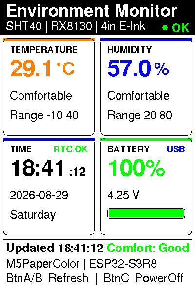

# M5Stack PaperColor Projects

[中文文档](README.zh-CN.md)

This repository contains applications, shared code, and hardware notes for the **M5Stack PaperColor (C151)** full-color e-ink device.


## About M5Stack PaperColor

PaperColor (SKU: C151) is a portable, full-color e-ink development device built around the Espressif **ESP32-S3R8**. Its 4-inch 400×600 Spectra 6 display is well suited to low-power information displays, while its onboard sensors, RTC, microSD slot, audio hardware, and expansion port make it a practical platform for embedded projects.

| Hardware | Specification |
| --- | --- |
| SoC | ESP32-S3R8, dual-core Xtensa LX7 at up to 240 MHz |
| Memory | 16 MB flash and 8 MB octal PSRAM |
| Display | 4-inch ED2208 E Ink Spectra 6 full-color display, 400×600 |
| Connectivity | 2.4 GHz Wi-Fi and USB-C power/data |
| Storage | microSD card slot |
| Onboard devices | SHT40 temperature/humidity sensor, RX8130CE RTC, M5PM1 power management |
| Interaction | Three user buttons, one power button, IR transmitter, two RGB LEDs, and HY2.0-4P expansion port |
| Audio | ES8311 audio codec, MEMS microphone, and 1 W speaker |
| Power | 1250 mAh battery |

See the [official M5Stack PaperColor documentation](https://docs.m5stack.com/zh_CN/core/PaperColor) for the complete specification, pin mapping, schematics, and hardware notes. Full-screen refreshes take approximately 15–30 seconds depending on image complexity, so applications should update deliberately rather than continuously.

Current environment-monitor interface:



## Repository layout

```text
m5papercolor-projects/
├── apps/                       Independently buildable and flashable applications
│   └── environment-monitor/    Temperature, humidity, time, and power monitor
├── shared/                     Stable code shared by multiple applications
├── hardware/                   Pinout, component, and hardware-test notes
└── docs/                       Cross-application documentation
```

Every application is a standalone PlatformIO project with its own `platformio.ini`, source code, tests, tools, and README. Add new device applications under `apps/<project-name>/`.

## Setup

Install the Python build tooling:

```bash
python3 -m pip install -r requirements.txt
```

`requirements.txt` provides PlatformIO Core. Exact firmware-library versions are pinned in each application's `platformio.ini`; the included preview and test scripts use only the Python standard library.

## Applications

| Application | Status | Description |
| --- | --- | --- |
| [`environment-monitor`](apps/environment-monitor/) | Builds successfully and has been flashed to hardware | Displays temperature, humidity, RTC time, and power status |

## Common commands

Run these commands from the repository root:

```bash
# Run host-side regression tests
python3 -m unittest discover -s apps/environment-monitor/tests -v

# Build the firmware
pio run -d apps/environment-monitor

# Upload the firmware (change the port when needed)
pio run -d apps/environment-monitor -t upload --upload-port /dev/cu.usbmodem21201

# Render and validate the UI preview
python3 apps/environment-monitor/tools/preview_v3.py /tmp/papercolor-ui.png
```

The root `.gitignore` excludes local `.pio` build caches, Wi-Fi credentials, and temporary files, so they are not uploaded to GitHub.
